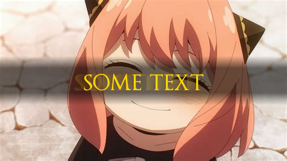

# diedtext

**Authors:** realsunsettler (Genesis Creator), frosty

## Overview

diedtext is a Python script that overlays echo-style text on images with a faded background effect. The script allows users to customize the text and font, and the resulting image is saved in PNG format.

## Table of Contents

- [Installation](#installation)
- [Usage](#usage)
- [Examples](#examples)
- [Directory Structure](#directory-structure)
- [License](#license)

## Installation

1. **Clone the repository**:
    ```sh
    git clone https://github.com/yourusername/diedtext.git
    cd diedtext
    ```

2. **Install required packages**:
    ```sh
    pip install -r requirements.txt
    ```

3. **Fonts**: Ensure that the fonts `OptimusPrinceps.ttf` and `OptimusPrincepsSemiBold.ttf` are not in the `fonts` directory but in the main. Newly downloaded fonts will be put into a directory created after first custom font used

## Usage

1. **Run the script**:
    ```sh
    python diedtext.py
    ```

2. **Follow the prompts**:
    - Enter the path of the image you want to modify.
    - Enter the text to overlay on the image.
    - Optionally, specify the font name. If no font is specified, the default font (`OptimusPrinceps.ttf`) will be used.

3. **Example**:

    If you have the following structure:
    ```
    diedtext-main
    ├── fonts
    ├── images
    │   ├── demo-without.jpeg
    │   └── demo-without_output.png
    ├── diedtext.py
    ├── OptimusPrinceps.ttf
    ├── OptimusPrincepsSemiBold.ttf
    └── README.md
    ```

    Run the script and provide the image path as `images/demo-without.jpeg`:
    ```sh
    python diedtext.py
    ```

    Follow the prompts to overlay the text and generate the output image.

## Examples

1. **Initial Image**:
    - Path: `images/demo-without.jpeg`
    - 

2. **Generated Image with Overlay Text**:
    - Path: `images/demo-without_output.png`
    - 

## Directory Structure

```
diedtext-main
├── fonts
│   ├── OptimusPrinceps.ttf
│   └── OptimusPrincepsSemiBold.ttf
├── images
│   ├── demo-without.jpeg
│   └── demo-without_output.png
├── diedtext.py
└── README.md
```

- `fonts/`: Contains the font files used for the text overlay.
- `images/`: Contains the input images and generated output images.
- `diedtext.py`: The main Python script to overlay text on images.
- `README.md`: This readme file.

## License

This project is licensed under the MIT License - see the [LICENSE](LICENSE) file for details.


font: https://www.dafont.com/optimusprinceps.font


